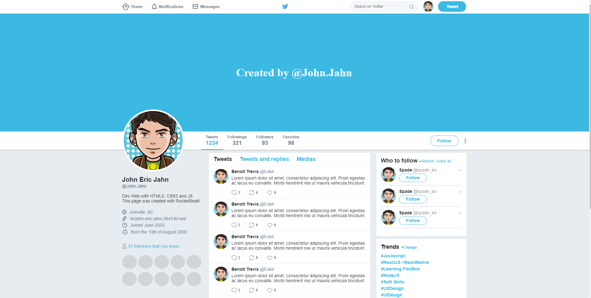
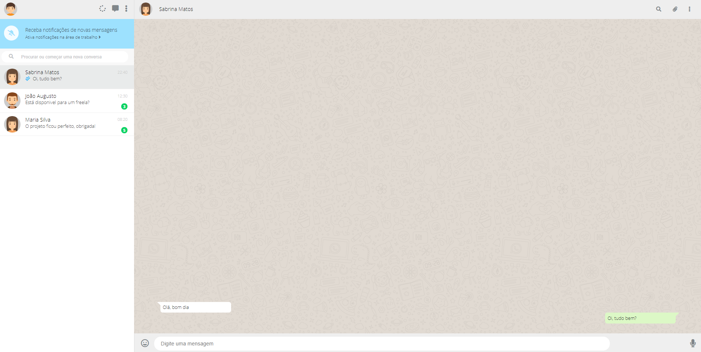
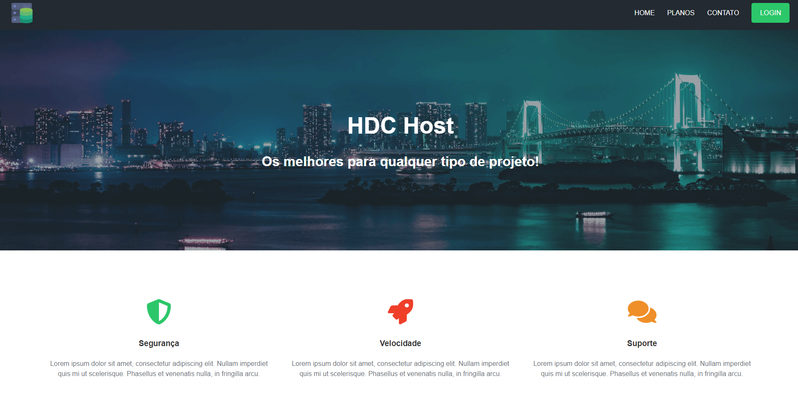
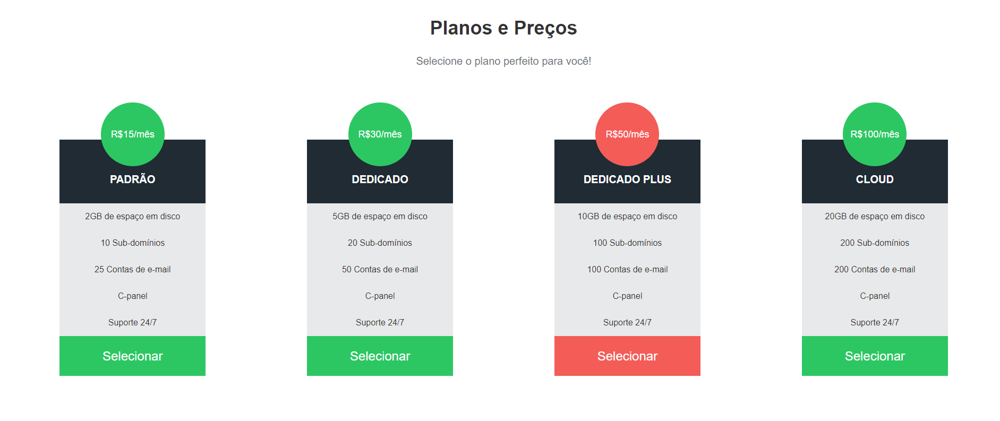
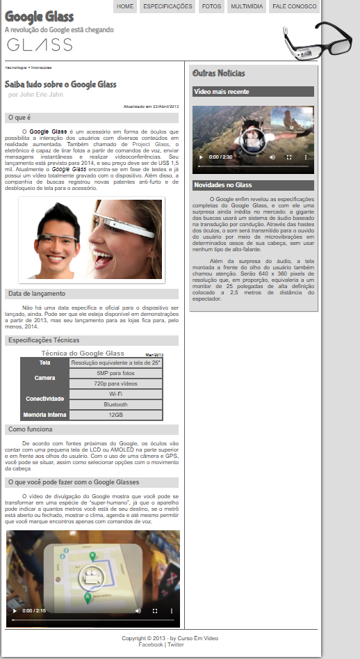
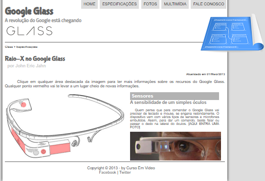
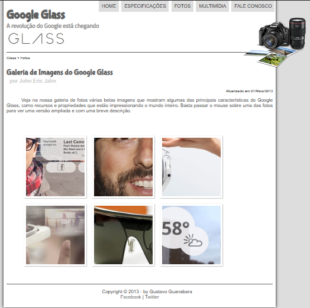
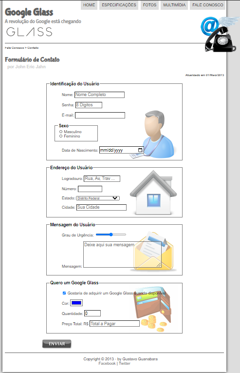
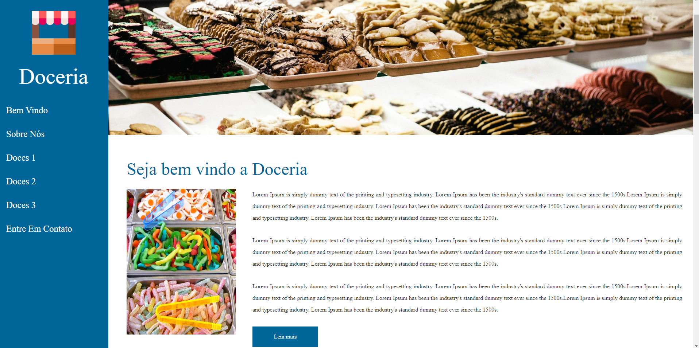
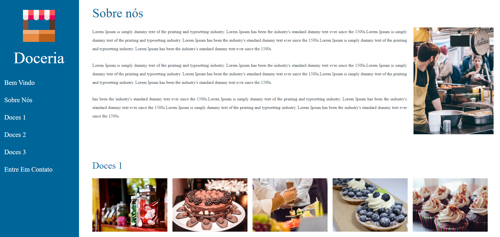

<h1 align="center"> 
	:octocat: List Of WebSites :octocat:
</h1>

	
  

<h2>:information_source: What's This Repositorie About?</h2>

I created this repository to expose all the layouts I developed with HTML5 and CSS.
If you want, you can clone this repository and execute in your own computer, all images and files are in the folder.

<h2>:rocket: Technologies</h2>
<ul>
  <li>[HTML5]</li>
  <li>[CSS3]</li>
  <li>[FlexBox]</li>
  <li>[ReponsiveDesign]</li>
</ul>

<h2>🔖 Layouts</h2>

<h3 align="center">Twitter Clone</h3>

 
  

 

<h3 align="center">WebWhatsApp Clone</h3>

 
  

 

<h3 align="center">HDC Host</h3>

 
  
  

 

<h3 align="center">Google Glass</h3>

 
  
  
  
  

 

<h3 align="center">Doceria</h3>

 
  
  

